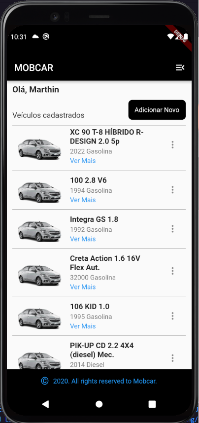
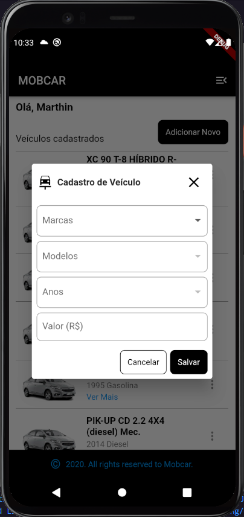

# MOBCAR

**MOBCAR é um aplicativo desenvolvido em FLUTTER**

Aplicação que permite você criar, listar, editar e deletar carros. O cadastro dos veículos são feitos com dados consultados na **FIPE API HTTP REST**(https://deividfortuna.github.io/fipe/), contendo uma lista de marcas, modelos conforme as marcas, anos disponíveis por modelo e o valor segundo a tabela FIPE.

---

#### Flutter

---

---

## Instalação | Execução

Clone esse repositório rodando o comando:

    git clone https://github.com/MarthinKorb/mobcar_flutter.git

Com o projeto aberto, execute os comandos:

    flutter pub get

e após:

    flutter run

---

# Sobre o ## Flutter

É um Framework de Dart para construir aplicações para a plataforma Android e Ios.

Quer saber mais sobre o _Flutter_? Acesse [https://flutter.dev/]

**Feito!** ✔

---
